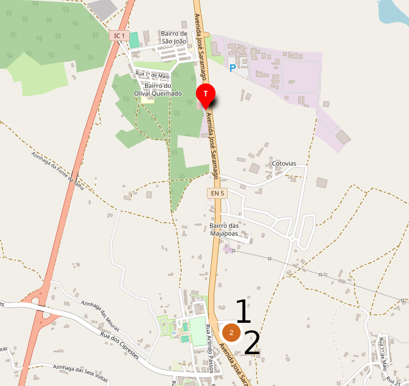
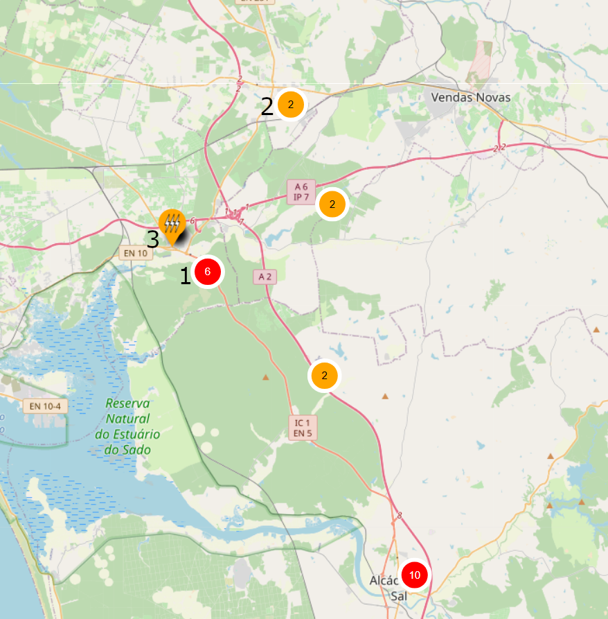
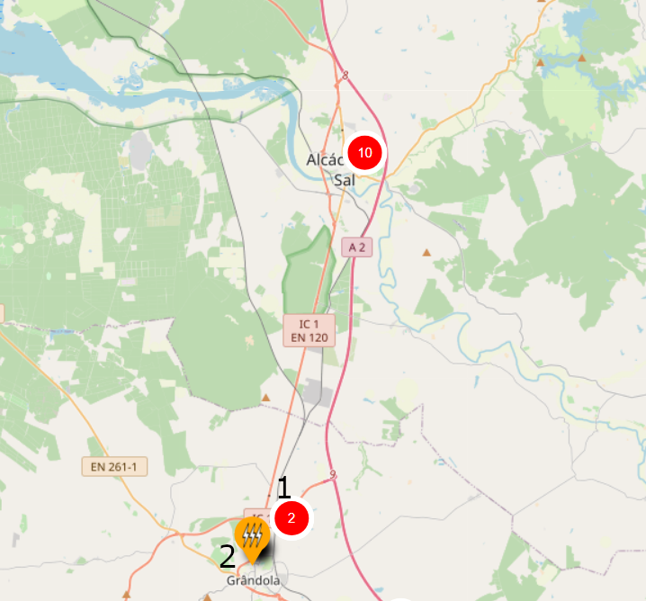

# Supercharger Alcácer do Sal

## A menos de 5km

1. [**ASL-00018 Aldi Alcácer do Sal**](https://maps.app.goo.gl/Wkg7h2twwRK71o478) : 1x50 kW  
2. [**ASL-00014 Lidl Alcácer do Sal**](https://maps.app.goo.gl/WKcv7wLM4gPwd9JB9) : 1x50 kW

    > Apenas compensa usar um destes postos caso a fila no Supercharger seja superior a 25 minutos.

## Norte, a mais de 5km

1. [**PLM-00036 Ionity Marateca**](https://maps.app.goo.gl/8hNjQj5wUdErfd3L6) : 6x350 kW  
2. [**MTJ-00065/66 Albergaria Malaposta Pegões**](https://maps.app.goo.gl/BxQJndc8TGCRLf9p7) : 2x160 kW

    > Nestes postos é possível carregar a uma potência superior ao Supercharger pelo que compensará usar.

3. [**PLM-00025 Águas de Moura**](https://maps.app.goo.gl/AYDmzGtQJ9nRRcvN6) : 1x80 kW

    > Neste posto é possível carregar a uma potência ligeiramente superior que no Supercharger quando a ocupação do Supercharger é superior a 50%. Compensa usar quando a fila no Supercharger for superior a 10 minutos.

## Sul, a mais de 5km

1. [**GDL-00040…43 BP Bairro do Isaías S>N**](https://maps.app.goo.gl/N5hVgHx2YdGm1y876) : 4x400 kW + 4x200 kW  
2. [**GDL-00017 BP Grândola**](https://maps.app.goo.gl/kz9AWqdXvnANuRC68) : 2x150 kW

    > Nestes postos é possível carregar a uma potência superior ao Supercharger pelo que compensará usar.

