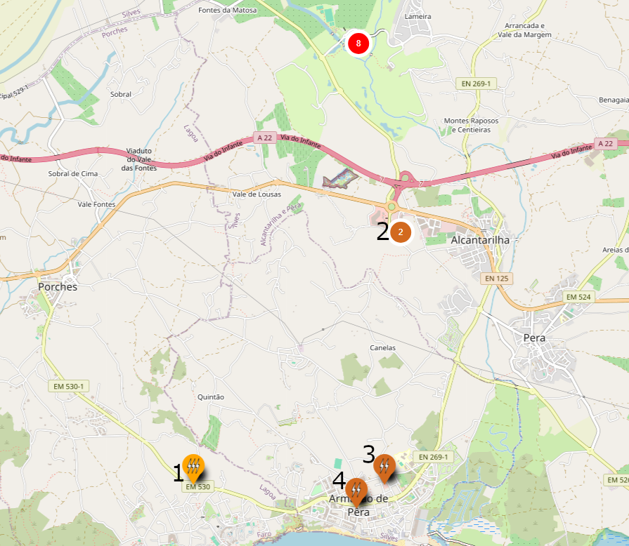
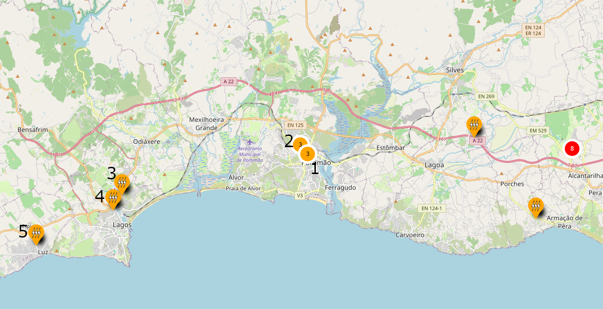
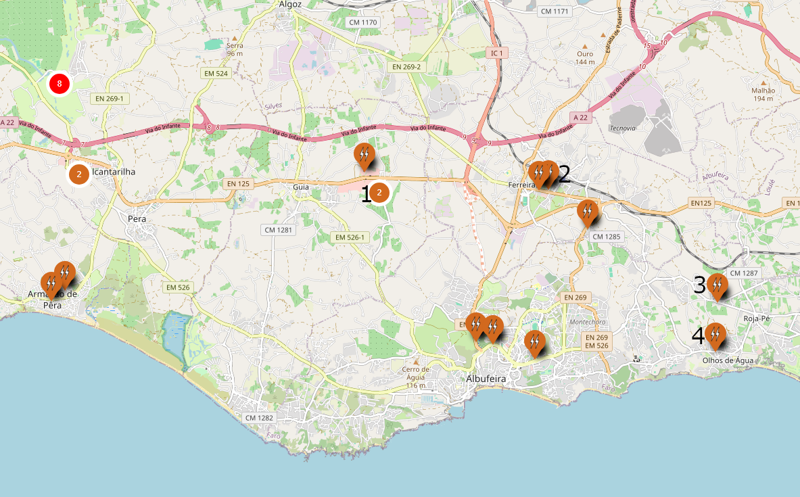

# Supercharger Alcantarilha

## A menos de 5km

1. [**FAR-00063 Cepsa Alporchinhos**](https://maps.app.goo.gl/aLdCyUX7hXSCErYo6) : 2x200 kW

    > Neste posto é possível carregar a uma potência superior ao Supercharger, face ao desvio compensa usar caso a fila no Supercharger seja superior a 5 minutos.

2. [**FAR-00033 Sudoeste Retail Park**](https://maps.app.goo.gl/nUUow2rV3DhRHzgc7) : 3x80 kW

    > Neste posto é possível carregar a uma potência ligeiramente superior que no Supercharger quando a ocupação do Supercharger é superior a 50% pelo que compensará usar este posto nessa situação.

3. [**SLV-00012 Pingo Doce Armação de Pêra**](https://maps.app.goo.gl/eCu4uDMb8sx4FErw7) : 1x50 kW  
4. [**SLV-00032 Lidl Armação de Pêra**](https://maps.app.goo.gl/c79ZPPGMVTkyFkY68) : 1x50 kW

    > Apenas compensará usar um destes postos caso a fila no Supercharger seja superior a 35 minutos.

## Oeste, a mais de 5km

1. [**PTM-00042 Norauto Portimão**](https://maps.app.goo.gl/UKDXTGFtvacK2dZMA) : 3x200 kW

    > Neste posto é possível carregar a uma potência superior ao Supercharger pelo que compensará usar.

2. [**PTM-00058 Roady Portimão**](https://maps.app.goo.gl/64HHZD1uWmLu51R27) : 1x120 kW + 2x100 kW

    > Neste posto é possível carregar a uma potência ligeiramente superior que no Supercharger quando a ocupação do Supercharger é superior a 50% pelo que compensará usar este posto nessa situação.

3. [**LGS-00037 BP Lagos**](https://maps.app.goo.gl/kdJ1JJcn4Y9nXjnG7) : 2x150 kW

    > Neste posto é possível carregar a uma potência superior ao Supercharger pelo que compensará usar caso não tenha que voltar para trás no seu percurso.

4. [**LGS-00030 Galp Lagos**](https://maps.app.goo.gl/SBUf8uXRFT8Fhvwr7) : 2x80 kW

    > Neste posto é possível carregar a uma potência ligeiramente superior que no Supercharger quando a ocupação do Supercharger é superior a 50% pelo que compensará usar este posto nessa situação caso não tenha que voltar para trás no seu percurso.

5. [**LGS-00039 Belavista Hotel Luz**](https://maps.app.goo.gl/9krBjJXNdZEhwBUD8) : 2x150 kW

    > Neste posto é possível carregar a uma potência superior ao Supercharger pelo que compensará usar caso não seja um desvio grande na sua rota.

## Este, a mais de 5km

1. [**ABF-00055 Decathlon Albufeira**](https://maps.app.goo.gl/E1LUyvR1SrqAoHvp7) : 1x100 kW + 2x80 kW

    > Neste posto é possível carregar a uma potência superior que no Supercharger quando a ocupação do Supercharger é superior a 50%, compensará caso a fila no Supercharger seja superior a 5 minutos.

2. [**ABF-00050 Intermarché Ferreiras**](https://maps.app.goo.gl/uQhPDBuv9EYNhPrK7) : 1x80 kW

    > Devido ao desvio para lá chegar só compensará usar caso haja fila no Supercharger superior a 10 minutos.

3. [**ABF-00061 Galp Vale da Azinheira**](https://maps.app.goo.gl/oQAsRwGnWfxdb6of6) : 1x80 kW  
4. [**ABF-00051 Intermarché Torre da Medronheira**](https://maps.app.goo.gl/xFFVNFpGEaaHjc5Y6) : 1x80 kW

    > Considerando o desvio necessário, só compensará usar caso haja fila no Supercharger superior a 25 minutos.
