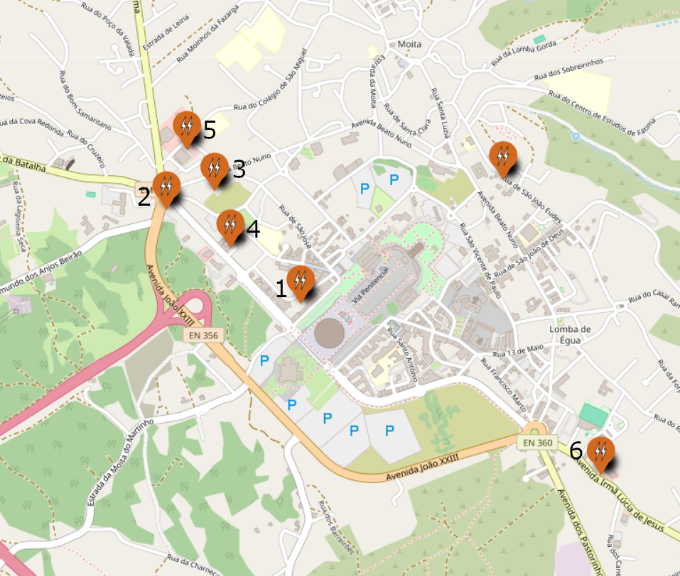
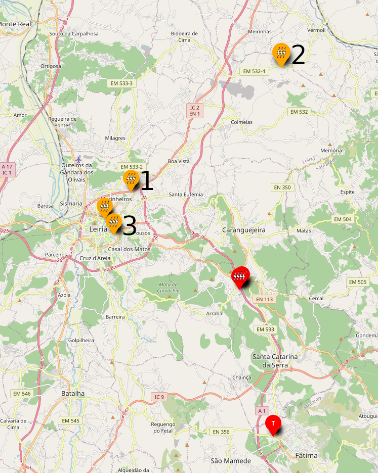
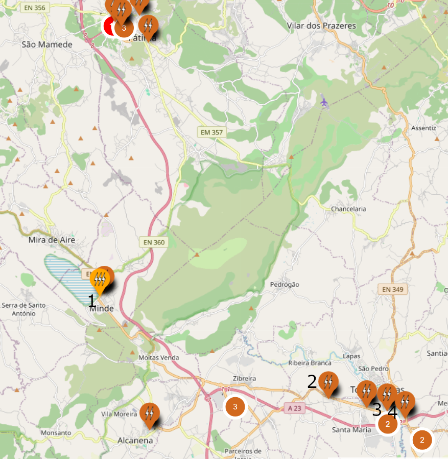

# Supercharger Fátima

## A menos de 5km

1. [**ORM-00023 Hotel Crisol 3 Pastorinhos**](https://maps.app.goo.gl/rxFvyPgp51FG3quB7) : 2x120 kW  
2. [**ORM-00017 Burger King Fátima**](https://maps.app.goo.gl/PDpvMUnEe7Bq62WPA) : 1x80 kW  
3. [**ORM-00003 McDonald’s Fátima**](https://maps.app.goo.gl/NUGCpGjZrNU7bFuh6): 1x80 kW

    > Nos postos acima é possível carregar a uma potência ligeiramente superior que no Supercharger quando a ocupação do Supercharger é superior a 50% pelo que compensará usar um destes postos nessa situação.

4. [**ORM-00011 Pingo Doce Fátima Santuário**](https://maps.app.goo.gl/bkxXfRbwKjz93goKA) : 1x60 kW, horário 09:00-21:00

    > Só compensará usar caso haja fila no Supercharger superior a 15 minutos.

5. [**Continente Bom Dia Fátima**](https://maps.app.goo.gl/QbtNoewTyzx1ufYf7): 2x50 kW

6. [**ORM-00018 Pingo Doce Fátima**](https://maps.app.goo.gl/htESYbJsHoRLKyWu6): 1x50 kW

    > Apenas compensa usar um destes postos caso a fila no Supercharger seja superior a 25 minutos.

## Norte, a mais de 5km

1. [**LRA-00046 Lubrisport Audi**](https://maps.app.goo.gl/NvGmibxA5T7nV7EH7) : 1x140 kW

    > Neste posto é possível carregar a uma potência superior ao Supercharger quando a ocupação do Supercharger é superior a 50% pelo que compensará usar nessa situação.

2. [**LRA-00117 BP Confraria**](https://maps.app.goo.gl/hRWXrXn4sWpBoudE9) : 2x150 kW

    > Aqui é possível carregar à mesma velocidade que no Supercharger mas implica um desvio significativo na rota. Apenas compensa se a fila no Supercharger for superior a 10 minutos.

3. [**LRA-00077 Hub Intermarché Leiria**](https://maps.app.goo.gl/jRm9U3rNMX3AsLJPA) : 1x150 kW + 3x50 kW

    > Neste posto é possível carregar a uma potência superior ao Supercharger quando a ocupação do Supercharger é superior a 50% pelo que compensará usar este posto nessa situação. No entanto, os comentários da comunidade referem a existência de problemas ocasionais com este posto. 

## Sul, a mais de 5km

1. [**ACN-00011 Intermarché Minde**](https://maps.app.goo.gl/5hE9MiMGVb1RbeJS7) : 2x150 kW

    > Neste posto é possível carregar a uma potência superior ao Supercharger quando a ocupação do Supercharger é superior a 50%. Compensa usar caso a fila seja superior a 5 minutos.

2. [**TNV-00022 Prio N3 Torres Novas**](https://maps.app.goo.gl/J71Axkv2QU1kMZw17) : 1x100 kW

    > Compensa usar caso a fila no Supercharger seja superior a 10 minutos.

3. [**TNV-00020 Burger King Torres Novas**](https://maps.app.goo.gl/VGrojQZx1mhczwaL7) : 1x80 kW  

4. [**TNV-00011 KFC Torres Novas**](https://maps.app.goo.gl/mxgmYHaVLr5taxgA8) : 1x80 kW

    > Tendo em conta o desvio que é necessário realizar, só compensará usar estas opções se a fila no Supercharger for superior a 15 minutos.

*Nota*: Os postos de 50 kW na zona de Zibreira ou Alcanena, apesar de mais próximos da A1, levam a um tempo de paragem superior do que o desvio até Torres Novas.
