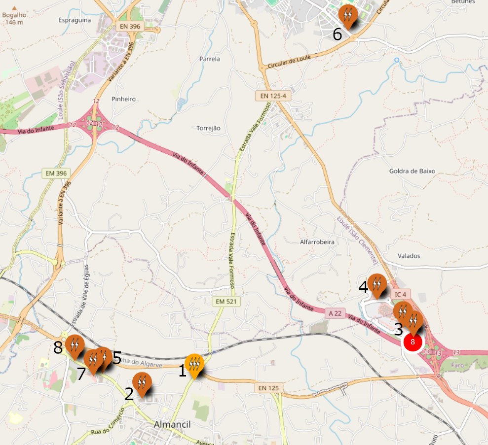
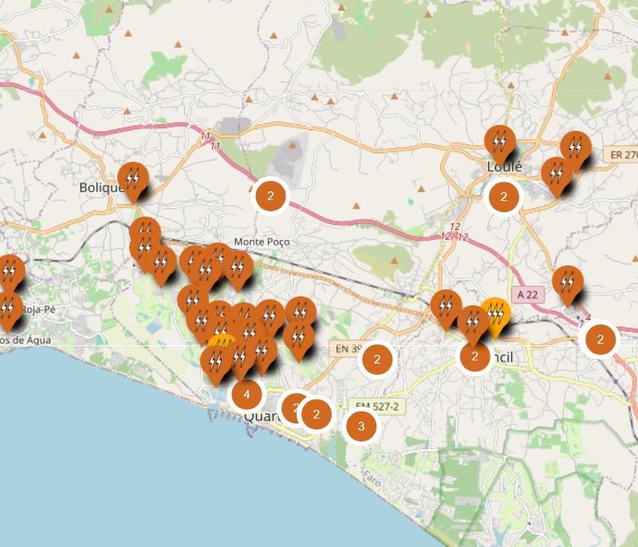
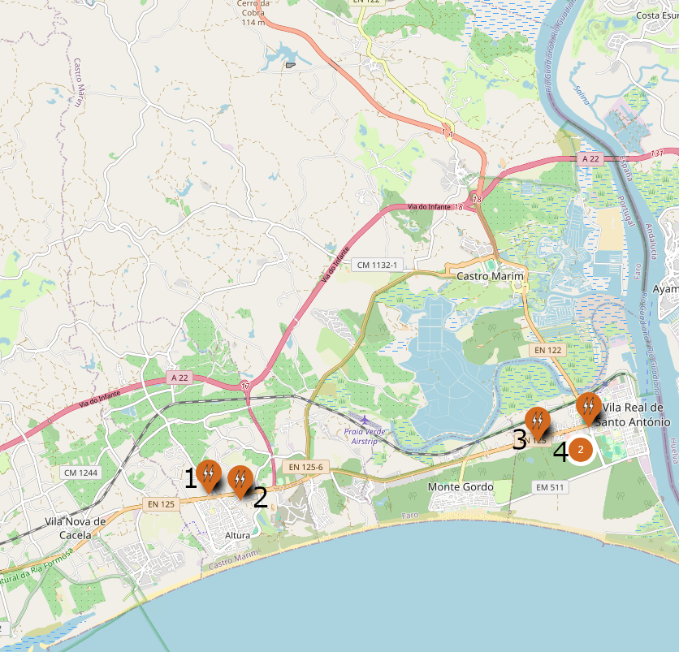

# Supercharger Loulé

## A menos de 5km

1. [**LLE-00223 BP Almancil**](https://maps.app.goo.gl/vSRH44hGrAqDH6nm9) : 2x150 kW

    > Neste posto é possível carregar a uma potência superior ao Supercharger caso o mesmo esteja cheio pelo que compensará usar.

2. [**LLE-00176 Pingo Doce Almancil**](https://maps.app.goo.gl/N9ej4j5n2xfCAzL9A) : 1x100 kW

    > Compensará usar caso haja fila no Supercharger superior a 5 minutos.

3. [**LLE-00099/107 IKEA / Mar Shopping**](https://maps.app.goo.gl/deY8eTTBpGQTNkWH9) : 2x50 kW  
4. [**LLE-00156 Lidl Caliços**](https://maps.app.goo.gl/eWkS46oV4pPANyCg8) : 1x50 kW

    > Apesar da proximidade geográfica apenas compensa usar estes postos caso a fila no Supercharger seja superior a 25 minutos.

5. [**LLE-00215 Apolónia**](https://maps.app.goo.gl/vxZoShoqWDAqFSbG9) : 1x60 kW

    > Compensa caso a fila no Supercharger seja superior a 20 minutos.

6. [**Continente Loulé**](https://maps.app.goo.gl/UKifEzwFp21WpxPJ9) : 2x50 kW  
7. [**LLE-00144 Lidl Almancil**](https://maps.app.goo.gl/RgueSLpSMtmFtkKC6) : 1x50 kW

    > Compensa apenas caso a fila no Supercharger seja superior a 30 minutos.

8. [**LLE-00069 Burgers & Bowls Almancil**](https://maps.app.goo.gl/C9oPCJUAUZoCm9pE9) : 1x50 kW

    > Apenas compensa caso a fila no Supercharger seja superior a 30 minutos, no entanto este posto não é dos mais fiáveis.

## Oeste, a mais de 5km

Não existem alternativas viáveis que fiquem perto da A22 sem obrigar a desviar a rota de forma significativa.   
  
Recomenda-se usar um dos postos na zona de Vilamoura / Quarteira.   
Procure na App postos Mobi.E com potência igual ou superior a 100 kW.

## Este, a mais de 5km

1. [**CTM-00004 Prio Altura**](https://maps.app.goo.gl/KFavU4ugzip2DSJ59) : 2x80 kW

    > Só compensará usar caso haja fila no Supercharger superior a 15 minutos.

2. [**CTM-00007 Pingo Doce Altura**](https://maps.app.goo.gl/ZynE3ZeSPKaM2YAm7): 1x60 kW  
3. [**VRS-00004 McDonald’s Hortas V.R.S.A.**](https://maps.app.goo.gl/sHPh9poiNKmGfbeP7) : 1x80 kW

    > Só compensará usar caso haja fila no Supercharger superior a 20 minutos.

4. [**VRS-00007/8 Pingo Doce Hortas V.R.S.A.**](https://maps.app.goo.gl/xFY3VqJD8ophgQnHA) : 2x60 kW

    > Apenas compensa caso a fila no Supercharger seja superior a 30 minutos.
