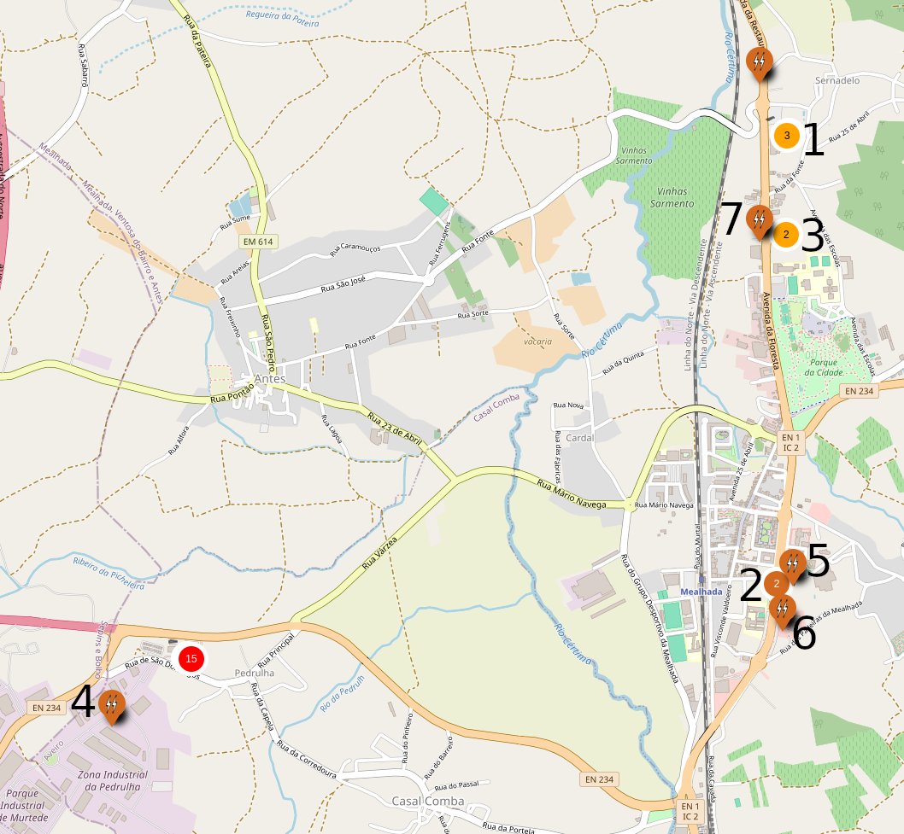
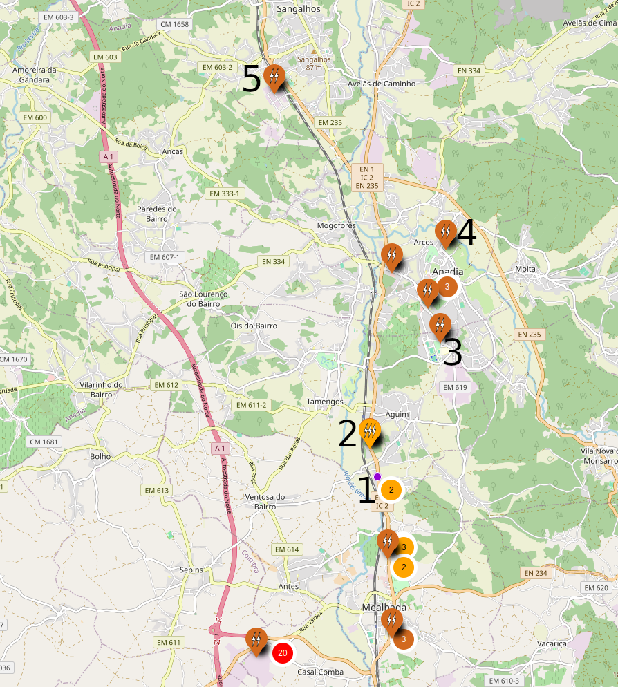
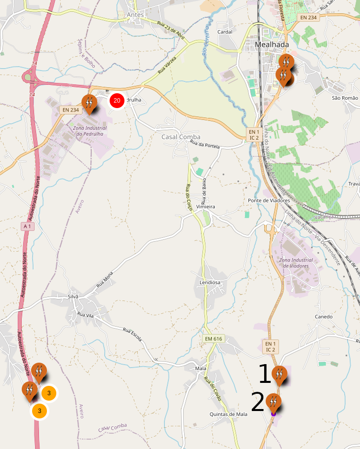

# Supercharger Mealhada

## A menos de 5km

1. [**MLD-00008/9 Pedro dos Leitões**](https://maps.app.goo.gl/WgAMiomt67cKPuEh8) : 6x150 kW + 2x120 kW + 2x100 kW

    > Neste posto é possível carregar a uma potência superior que no Supercharger quando a ocupação do Supercharger é superior a 50% pelo que compensará usar nessa situação.

2. [**MLD-00035 Aldi Mealhada**](https://maps.app.goo.gl/okuv26DCo9Vxmc5d7) : 2x120 kW

    > Neste posto é possível carregar a uma potência superior que no Supercharger quando a ocupação do Supercharger é superior a 50%, considerando o desvio compensará usar quando a fila no Supercharger for superior a 5 minutos.

3. [**MLD-00040/41 Nelsonft dos Leitões**](https://maps.app.goo.gl/7TvfYhmiDYnG17xT9) : 4x80 kW

    > Neste posto é possível carregar a uma potência ligeiramente superior que no Supercharger quando a ocupação do Supercharger é superior a 50%, considerando o desvio compensará usar quando a fila no Supercharger for superior a 10 minutos.

4. [**MLD-00013 Alves Bandeira**](https://maps.app.goo.gl/VJQzX8foV3d9wB6Z7) : 1x50 kW

    > Só compensará usar caso haja fila no Supercharger superior a 15 minutos.

5. [**Continente Bom Dia Mealhada**](https://maps.app.goo.gl/WvbS4c9ty8eaiffd7) : 2x50 kW  
6. [**MLD-00014 Lidl Mealhada**](https://maps.app.goo.gl/Lxs8KPBMLom15z2R9) : 1x50 kW  
7. [**MLD-00011 Pingo Doce Mealhada**](https://maps.app.goo.gl/cwZyiY4Zz8vAs5AX6) : 1x50 kW

    > Só compensará usar caso haja fila no Supercharger superior a 30 minutos.

## Norte, a mais de 5km

1. [**AND-00012/13 Metinha dos Leitões**](https://maps.app.goo.gl/2WcWhoNGcwhJ27yX7) : 2x160kW

    > Neste posto é possível carregar a uma potência superior que no Supercharger quando a ocupação do Supercharger é superior a 50% pelo que compensará usar nessa situação.

2. [**AND-00005 Nova Casa dos Leitões**](https://maps.app.goo.gl/qjjK2SLebKyGSwQP7) : 2x120kW + 1x80 kW

    > Considerando o desvio compensará usar caso a fila no Supercharger seja superior a 10 minutos.

3. [**AND-00017 Eco Parque Anadia**](https://maps.app.goo.gl/ed9GVMvitkFXQyaFA) : 2x120 kW  
4. [**AND-00016 Parque Urbano Anadia**](https://maps.app.goo.gl/c7dR1EzfiiVsnV2J8) : 2x120 kW  
5. [**AND-00028 Zona Industrial Paraimo**](https://maps.app.goo.gl/NPJTWb3t9nYzdtVJ6) : 2x120 kW

    > Considerando o desvio compensará usar caso a fila no Supercharger seja superior a 15 minutos.

## Sul, a mais de 5km

1. [**MLD-00018 Prio N1 Pampilhosa do Botão**](https://maps.app.goo.gl/bDTgTjzQzFXU1fvn9) : 1x90 kW

    > Neste posto é possível carregar a uma potência ligeiramente superior que no Supercharger quando a ocupação do Supercharger é superior a 50%, considerando o desvio compensará usar caso a fila no Supercharger seja superior a 5 minutos.

2. [**MLD-00017 Restaurante O Vitor N1 Carqueijo**](https://maps.app.goo.gl/hN7tVnsEYmkbeEKMA) : 2x80 kW

    > Neste posto é possível carregar a uma potência ligeiramente superior que no Supercharger quando a ocupação do Supercharger é superior a 50%, considerando o desvio compensará usar caso a fila no Supercharger seja superior a 10 minutos.
